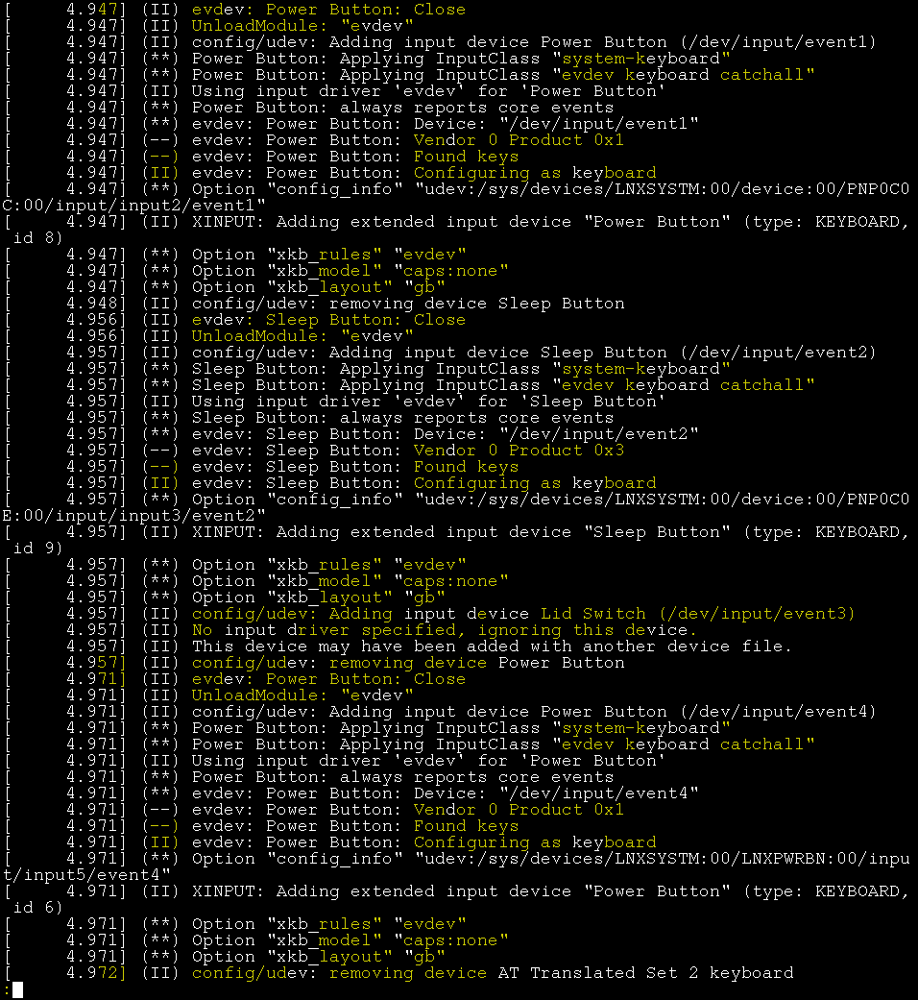

# Logdiff

Logdiff is a tool for identifying patterns and changes in log files.

## Usage

    Usage: logdiff [options] file

    Options:
      -h, --help  show this help message and exit
      -n N        Set similarity threshold (default 0.75)

Logdiff will only highlight changes between lines if the lines are deemed similar enough to be related. The threshold at which lines are deemed similar can be adjusted with the `-n` option.

## Paging

Often, you'll want to be able to page the output of logdiff. The best tool for this is `less` with the "raw colours" option enabled.

e.g. `logdiff mylog.log | less -r`

## Screenshot

Obligatory. This is logdiff inspecting my Xorg.log

